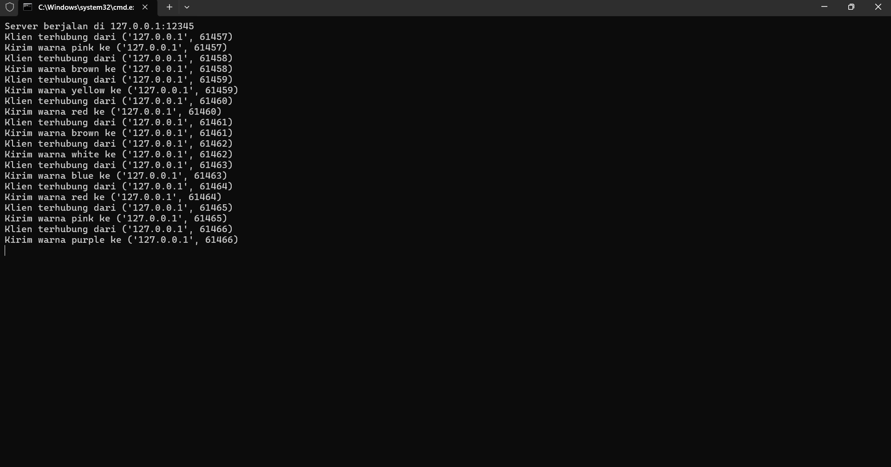

<h1 align="left">
    
</h1>

```
Nama : Okky Rangga Pratama
NIM : 1203220011
Kelas : IF-02-01
```

<hr>

## Daftar Isi

### - [Alur Kode](#alur-kode)
### - [Penggunaan](#Penggunaan)

<hr>

## Soal
Buatlah sebuah permainan yang menggunakan soket dan protokol UDP. Permainannya cukup sederhana, dengan 1 server dapat melayani banyak klien (one-to-many). Setiap 10 detik, server akan mengirimkan kata warna acak dalam bahasa Inggris kepada semua klien yang terhubung. Setiap klien harus menerima kata yang berbeda (unik). Selanjutnya, klien memiliki waktu 5 detik untuk merespons dengan kata warna dalam bahasa Indonesia. Setelah itu, server akan memberikan nilai feedback 0 jika jawabannya salah dan 100 jika benar.

<br>
<hr>

## Alur Kode

Kode ini bekerja menggunakan soket UDP dalam bahasa python. Dengan menerapkan konsep one-to-many yang berarti 1 Server bisa melayani banyak client dalam waktu yang bersamaan ketika program dijalankan.

Berikut Penjelasan kode dari server dan client

`server.py`

```python
import socket
import random
import time


def generate_random_color():
    colors = ["red", "green", "blue", "yellow", "purple",
              "orange", "black", "white", "brown", "pink"]
    return random.choice(colors)


server_ip = "127.0.0.1"
server_port = 12345

server_socket = socket.socket(socket.AF_INET, socket.SOCK_DGRAM)
server_socket.bind((server_ip, server_port))

print(f"Server berjalan di {server_ip}:{server_port}")

connected_clients = set()

while True:
    try:
        data, client_address = server_socket.recvfrom(1024)
        data = data.decode("utf-8")

        if client_address not in connected_clients:
            connected_clients.add(client_address)
            print(f"Klien terhubung dari {client_address}")

        if data == "request_color":
            color = generate_random_color()
            server_socket.sendto(color.encode("utf-8"), client_address)
            print(f"Kirim warna {color} ke {client_address}")

    except KeyboardInterrupt:
        print("\nServer berhenti.")
        break

server_socket.close()
```

**Output :**



**Penjelasan :**

Berikut adalah penjelasan dari kode tersebut:

1. Kode mengimpor modul `socket` untuk membuat socket jaringan, modul `random` untuk mendapatkan warna secara acak, dan modul `time` untuk melakukan operasi yang terkait dengan waktu (meskipun tidak digunakan dalam kode ini).

2. Fungsi `generate_random_color()` mendefinisikan daftar warna-warna yang tersedia, dan kemudian memilih salah satu warna secara acak dari daftar tersebut menggunakan `random.choice()`.

3. Variabel `server_ip` dan `server_port` menyimpan alamat IP dan nomor port server. Dalam kode ini, alamat IP ditetapkan menjadi `"127.0.0.1"` (localhost), dan nomor port ditetapkan menjadi `12345`.

4. Sebuah socket UDP dibuat dengan menggunakan `socket.socket(socket.AF_INET, socket.SOCK_DGRAM)`, dan kemudian terikat ke alamat IP dan nomor port server dengan menggunakan `server_socket.bind((server_ip, server_port))`.

5. Kode mencetak pesan yang menunjukkan bahwa server sedang berjalan di alamat IP dan nomor port yang telah ditetapkan.

6. Set `connected_clients` digunakan untuk menyimpan daftar alamat klien yang terhubung ke server.

7. Dalam loop `while True`, server menunggu permintaan dari klien. Jika permintaan diterima dan berisi pesan "request_color", server akan memanggil fungsi `generate_random_color()` untuk mendapatkan warna secara acak, dan mengirimkan warna tersebut kembali ke klien.

8. Jika klien baru terhubung ke server, alamat klien akan ditambahkan ke set `connected_clients`, dan pesan akan dicetak untuk menunjukkan bahwa klien telah terhubung.

9. Jika terjadi interupsi keyboard (`KeyboardInterrupt`), loop akan berhenti, dan server akan menutup socket.

Secara keseluruhan, kode ini membuat sebuah server UDP yang dapat mengirimkan warna secara acak kepada klien yang terhubung ketika klien mengirim permintaan "request_color". Server ini berjalan di alamat IP `127.0.0.1` (localhost) dan nomor port `12345`.

<br>

``client.py`

```python
import socket
import time
import threading


def english_to_indonesian_color(english_color):
    color_mapping = {
        "red": "merah",
        "green": "hijau",
        "blue": "biru",
        "yellow": "kuning",
        "purple": "ungu",
        "orange": "oranye",
        "black": "hitam",
        "white": "putih",
        "brown": "coklat",
        "pink": "merah muda",
    }
    return color_mapping.get(english_color.lower(), "tidak dikenali")


server_ip = "127.0.0.1"
server_port = 12345

client_socket = socket.socket(socket.AF_INET, socket.SOCK_DGRAM)


while True:
    try:
        def input_with_timeout(prompt, timeout):
            print(prompt, flush=True)
            response = [None]

            def input_thread():
                try:
                    response[0] = input()
                except:
                    pass

            thread = threading.Thread(target=input_thread)
            thread.start()
            thread.join(timeout)

            if thread.is_alive():
                print(f"\nAnda tidak menjawab selama {timeout} detik\n")
                print("Tekan Enter untuk melanjutkan\n")
                thread.join()

                return None
            else:
                return response[0]

        client_socket.sendto("request_color".encode(
            "utf-8"), (server_ip, server_port))
        color, server_address = client_socket.recvfrom(1024)
        color = color.decode("utf-8")
        print(f"Warna yang diterima: {color}")

        response = input_with_timeout(
            "Sebutkan warna tersebut dalam bahasa indonesia! ", 5)

        indonesian_color = english_to_indonesian_color(color)
        if response is None:
            print("Waktu habis. Nilai feedback: 0")
        elif response.lower() == indonesian_color:
            print("Jawaban benar! Nilai feedback: 100")
        else:
            print("Jawaban salah. Nilai feedback: 0")

        print("Tunggu 10 detik untuk menerima warna baru\n")
        time.sleep(10)
    except KeyboardInterrupt:
        print("\nKlien berhenti.")
        break

client_socket.close()
```

**Output :**


**Penjelasan :**

Berikut adalah penjelasan dari kode tersebut:

1. Kode mengimpor modul `socket` untuk membuat socket jaringan, modul `time` untuk melakukan operasi yang terkait dengan waktu, dan modul `threading` untuk membuat thread baru.

2. Fungsi `english_to_indonesian_color(english_color)` memetakan warna dalam bahasa Inggris ke dalam bahasa Indonesia menggunakan dictionary `color_mapping`. Jika warna dalam bahasa Inggris tidak ditemukan dalam dictionary, maka akan dikembalikan "tidak dikenali".

3. Variabel `server_ip` dan `server_port` menyimpan alamat IP dan nomor port server (sama dengan kode server sebelumnya).

4. Sebuah socket UDP dibuat dengan menggunakan `socket.socket(socket.AF_INET, socket.SOCK_DGRAM)` untuk klien.

5. Fungsi `input_with_timeout(prompt, timeout)` digunakan untuk membaca input dari pengguna dengan batasan waktu `timeout` detik. Fungsi ini membuat sebuah thread baru yang menjalankan fungsi `input_thread()` untuk membaca input dari pengguna. Jika pengguna tidak merespons dalam waktu `timeout` detik, maka akan mencetak pesan dan mengembalikan `None`.

6. Dalam loop `while True`, klien mengirim permintaan "request_color" ke server dan menunggu balasan berupa warna dalam bahasa Inggris.

7. Setelah menerima warna dalam bahasa Inggris dari server, klien mencetak warna tersebut dan meminta pengguna untuk menerjemahkan warna tersebut ke dalam bahasa Indonesia menggunakan fungsi `input_with_timeout()` dengan waktu tunggu 5 detik.

8. Jawaban pengguna dibandingkan dengan terjemahan warna dalam bahasa Indonesia menggunakan fungsi `english_to_indonesian_color()`. Jika jawaban benar, maka akan dicetak pesan "Jawaban benar! Nilai feedback: 100", jika salah atau waktu habis, maka akan dicetak pesan "Jawaban salah. Nilai feedback: 0" atau "Waktu habis. Nilai feedback: 0".

9. Setelah memberikan feedback, klien akan menunggu selama 10 detik sebelum mengirim permintaan warna baru ke server.

10. Jika terjadi interupsi keyboard (`KeyboardInterrupt`), loop akan berhenti, dan klien akan menutup socket.

Secara keseluruhan, kode ini membuat sebuah klien UDP yang terhubung ke server warna dari kode sebelumnya. Klien akan meminta warna dalam bahasa Inggris dari server, dan meminta pengguna untuk menerjemahkan warna tersebut ke dalam bahasa Indonesia dengan batasan waktu 5 detik. Jika pengguna menjawab dengan benar, maka akan diberikan nilai feedback 100, jika salah atau waktu habis, maka nilai feedback adalah 0. Setelah memberikan feedback, klien akan menunggu 10 detik sebelum meminta warna baru dari server.

<br>
<hr>

## Penggunaan

### Menggunakan 1 Server dan 1 Client

Untuk menggunakan cara ini harus menjalankan 2 file yaitu server.py dan client.py (salah satu file client)

```
> python server.py
```
<br>


```
> python client.py
```

<br>


> Keterangan
> 
> - Jika Menebak warna dengan Benar maka akan mendapatkan nilai feedback 100
> - Jika menebak warna dengan Salah maka akan mendapatkan nilai feedback 0
> - Jika tidak menginputkan apapun maka akan muncul anda tidak menjawab dalam 5 detik dan tekan enter untuk melanjutkan
>
> Server akan memberikan warna baru kepada client setiap 10 detik jika menjawab dengan benar/salah/tidak menjawab


### Menggunakan 1 Server dan Banyak Client

Untuk menggunakan cara ini cukup menjalankan script run.py

```
> python run.py
```


> Keterangan
> 
> - Jika Menebak warna dengan Benar maka akan mendapatkan nilai feedback 100
> - Jika menebak warna dengan Salah maka akan mendapatkan nilai feedback 0
> - Jika tidak menginputkan apapun maka akan muncul anda tidak menjawab dalam 5 detik dan tekan enter untuk melanjutkan
>
> Server akan memberikan warna baru kepada client setiap 10 detik jika menjawab dengan benar/salah/tidak menjawab
