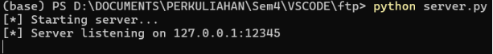
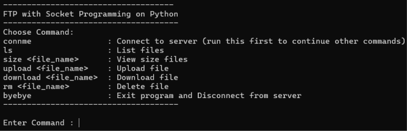

<h1 align="left">
    
</h1>

```
Nama : Okky Rangga Pratama
NIM : 1203220011
Kelas : IF-02-01
```

## Pendahuluan

Repository ini berisi tugas mata kuliah Pemrograman jaringan. Program yang dibuat adalah FTP Socket Programming menggunakan Python.

## Daftar Isi

### - [Penjelasan Kode Program](#Penjelasan)
### - [Simulasi Program](#Simulasi)

## Soal

Buat sebuah program file transfer protocol menggunakan socket programming dengan beberapa perintah dari client seperti berikut.

- `ls` : ketika client menginputkan command tersebut, maka server akan memberikan daftar file dan folder.
- `rm {nama file}` : ketika client menginputkan command tersebut, maka server akan menghapus file dengan acuan nama file yang diberikan pada parameter pertama.
- `download {nama file}` : ketika client menginputkan command tersebut, maka server akan memberikan file dengan acuan nama file yang diberikan pada parameter pertama.
- `upload {nama file}` : ketika client menginputkan command tersebut, maka server akan menerima dan menyimpan file dengan acuan nama file yang diberikan pada parameter pertama.
- `size {nama file}` : ketika client menginputkan command tersebut, maka server akan memberikan informasi file dalam satuan MB (Mega bytes) dengan acuan nama file yang diberikan pada parameter pertama.
- `byebye` : ketika client menginputkan command tersebut, maka hubungan socket client akan diputus.
- `connme` : ketika client menginputkan command tersebut, maka hubungan socket client akan terhubung.

## Penjelasan

`server.py`

```py
import socket
import os

SERVER_HOST = '127.0.0.1'
SERVER_PORT = 12345
BUFFER_SIZE = 1024


def list_files():
    files = os.listdir('.')
    if files:
        return '\n'.join(files)
    else:
        return "Directory is empty"


def file_size(filename):
    if os.path.exists(filename):
        size = os.path.getsize(filename) / (1024 * 1024)
        return f'{filename}: {size:.2f} MB'
    else:
        return 'File not found'


def remove_file(filename):
    try:
        os.remove(filename)
        return f'{filename} removed successfully'
    except OSError as e:
        return f'Error: {e.strerror}'


def receive_file(client_socket, filename):
    with open(filename, 'wb') as file:
        while True:
            data = client_socket.recv(BUFFER_SIZE)
            if not data:
                break
            file.write(data)


def send_file(client_socket, filename):
    if os.path.exists(filename):
        with open(filename, 'rb') as file:
            while True:
                data = file.read(BUFFER_SIZE)
                if not data:
                    break
                client_socket.send(data)
        print(f"[*] File '{filename}' sent successfully")
    else:
        print(f"[!] File '{filename}' not found")
        client_socket.send("File not found".encode())


def main():
    print("[*] Starting server...")
    with socket.socket(socket.AF_INET, socket.SOCK_STREAM) as server_socket:
        server_socket.bind((SERVER_HOST, SERVER_PORT))
        server_socket.listen(1)
        print(f"[*] Server listening on {SERVER_HOST}:{SERVER_PORT}")

        while True:
            client_socket, client_address = server_socket.accept()
            print(
                f"[*] Accepted connection from {client_address[0]}:{client_address[1]}")

            while True:
                data = client_socket.recv(BUFFER_SIZE).decode()

                if not data:
                    break

                if data == 'connme':
                    print("[*] Connection established.")
                    continue

                if data == 'ls':
                    files_list = list_files()
                    client_socket.send(files_list.encode())
                elif data.startswith('size'):
                    filename = data.split()[1]
                    file_info = file_size(filename)
                    client_socket.send(file_info.encode())
                elif data.startswith('rm'):
                    filename = data.split()[1]
                    removal_info = remove_file(filename)
                    client_socket.send(removal_info.encode())
                elif data.startswith('upload'):
                    filename = data.split()[1]
                    client_socket.send("Ready to receive file".encode())
                    receive_file(client_socket, filename)
                    client_socket.send(
                        f"{filename} uploaded successfully".encode())
                elif data.startswith('download'):
                    filename = data.split()[1]
                    send_file(client_socket, filename)
                elif data == 'byebye':
                    print(
                        f"[*] Closing connection from {client_address[0]}:{client_address[1]}")
                    client_socket.send("Connection closed".encode())
                    break
                else:
                    client_socket.send("Command not found".encode())

            client_socket.close()


if __name__ == "__main__":
    main()
```

**Output :**



**Analisis :**

Program diatas adalah implementasi sederhana dari server TCP yang memungkinkan klien untuk berinteraksi dengan file-file di direktori server. Server menerima permintaan dari klien seperti `daftar file`, `ukuran file`, `menghapus`, `mengunduh`, atau `mengunggah file`, dan `memberikan respons` sesuai. Ini dilakukan melalui penggunaan socket dan fungsi-fungsi bawaan Python untuk mengelola file dan koneksi jaringan. Berikut penjelasan kode programnya :

**1. Import library yang diperlukan :**
   - `socket` : Digunakan untuk membuat koneksi socket antara server dan klien.
   - `os` : Digunakan untuk berinteraksi dengan sistem operasi, seperti mengelola file.

**2. Mendefinisikan konstanta :**
   - `SERVER_HOST` : Menyimpan alamat IP server.
   - `SERVER_PORT` : Menyimpan port tempat server mendengarkan koneksi dari klien.
   - `BUFFER_SIZE` : Menyimpan ukuran buffer yang digunakan untuk mengirim dan menerima data.

**3. Definisi fungsi-fungsi :**
   - `list_files()` : Mengembalikan daftar file dalam direktori server.
   - `file_size(filename)` : Mengembalikan ukuran file (dalam MB) jika file tersebut ada.
   - `remove_file(filename)` : Menghapus file jika ada.
   - `receive_file(client_socket, filename)` : Menerima file dari klien dan menyimpannya di server.
   - `send_file(client_socket, filename)` : Mengirim file kepada klien jika file tersebut ada.

**4. Fungsi `main()` :**
   - Membuat socket server dan mengikatnya ke alamat dan port yang ditentukan.
   - Mengawakili server untuk koneksi masuk dan mengelola setiap koneksi menggunakan loop tak terbatas.
   - Menerima pesan dari klien, memprosesnya, dan memberikan respons sesuai permintaan klien.
   - Jika klien mengirim perintah `byebye`, server akan menutup koneksi dengan klien dan kembali mendengarkan koneksi baru.

**5. Eksekusi utama :**
   - Memulai server dengan memanggil fungsi `main()` jika file ini dijalankan sebagai skrip utama.

<br>

`client.py`

```py
import socket

SERVER_HOST = '127.0.0.1'
SERVER_PORT = 12345
BUFFER_SIZE = 1024


def main():
    print("\n------------------------------------")
    print("FTP with Socket Programming on Python")
    print("-------------------------------------")
    print("Choose Command:")
    print("connme                : Connect to server (run this first to continue other commands)")
    print("ls                    : List files")
    print("size <file_path>      : View size files")
    print("upload <file_path>    : Upload file")
    print("download <file_path>  : Download file")
    print("rm <file_path>        : Delete file")
    print("byebye                : Exit program and Disconnect from server")
    print("-------------------------------------")

    with socket.socket(socket.AF_INET, socket.SOCK_STREAM) as client_socket:
        while True:
            command = input("\nEnter Command : ").strip()
            if command == 'connme':
                client_socket.connect((SERVER_HOST, SERVER_PORT))
                print(f"[*] Connected to server {SERVER_HOST}:{SERVER_PORT}")
                client_socket.send(command.encode())
                print("[*] Connection established.")
                break

        while True:
            command = input("\nEnter Command : ").strip()
            client_socket.send(command.encode())

            if command == 'byebye':
                print("[*] Disconnecting from server...")
                print(client_socket.recv(BUFFER_SIZE).decode())
                break

            data = client_socket.recv(BUFFER_SIZE).decode()
            if data == "Command not found":
                print("[!] Command not found. Please enter a valid command.")
            else:
                print(data)


if __name__ == "__main__":
    main()
```

**Output :**



**Analisis :**

Program diatas menyediakan antarmuka sederhana bagi pengguna untuk berinteraksi dengan server FTP, dengan mendukung beberapa perintah dasar seperti `daftar file`, `unggah`, `unduh`, `hapus file`, serta `mengelola koneksi`. Melalui penggunaan loop untuk menerima masukan dan respons dari server, serta penanganan kesalahan yang memadai, klien memberikan pengalaman yang jelas dan dapat diandalkan bagi pengguna dalam berkomunikasi dengan server. Berikut penjelasan kode programnya :

**1. Impor modul `socket` :**
   - Modul ini digunakan untuk membuat koneksi soket antara klien dan server.

**2. Mendefinisikan konstanta :**
   - `SERVER_HOST` : Menyimpan alamat IP server.
   - `SERVER_PORT` : Menyimpan port tempat server mendengarkan koneksi dari klien.
   - `BUFFER_SIZE` : Menyimpan ukuran buffer yang digunakan untuk mengirim dan menerima data.

**3. Fungsi `main()` :**
   - Menampilkan pesan sambutan dan daftar perintah yang tersedia untuk pengguna.
   - Membuat soket klien menggunakan `socket.socket()` dengan domain `AF_INET` dan tipe `SOCK_STREAM`.
   - Loop pertama:
     - Menghubungkan klien ke server saat perintah `connme` dimasukkan.
     - Mengirim perintah `connme` ke server.
     - Memecah loop setelah koneksi berhasil dibuat.
   - Loop kedua:
     - Mengirim perintah yang dimasukkan oleh pengguna ke server.
     - Jika perintah adalah `byebye`, klien akan memutus koneksi dengan server dan keluar dari loop.
     - Menerima respons dari server dan mencetaknya.
     - Jika respons adalah `Command not found`, mencetak pesan kesalahan.
     - Loop akan terus berjalan hingga pengguna memasukkan perintah `byebye`.

<br>

## Simulasi

Untuk pertama, silahkan jalankan file `server.py` dan `client.py` di terminal kalian masing-masing dan akan muncul tampilan awal seperti dibawah ini:

`server.py`


`client.py`


